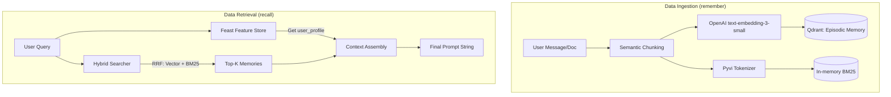

# Bonus Challenge: Hybrid Memory AI Assistant Architecture

**Contributor:** Nguyen Minh Hieu
**Student ID:** 2A202600180
**Cohort:** A20

## 1. Architecture Diagram (Data Flow)

## 2. Three Key Architecture Decisions & Tradeoffs

### A. Chunking Strategy: Semantic Chunking with Overlap vs. Per-Message
- **Decision:** Split incoming text into semantic paragraphs (~100-200 tokens) with a 50-token overlap, rather than storing individual raw messages.
- **Tradeoff:** 
  - *Pros:* Enhances retrieval quality significantly. A short query like "how does that work?" might fail if linked to a single cộc lốc (abrupt) message, but semantic chunks preserve the surrounding context.
  - *Cons:* Increases storage costs and OpenAI API token consumption due to redundant data indexing.

### B. Feature Schema: Tabular Features vs. Latent Embedding Features
- **Decision:** Store user profiles in Feast using explicit tabular attributes (e.g., `topic_affinity`, `reading_speed_wpm`) with specific TTLs (30 days for profile, 1 hour for recent queries).
- **Tradeoff:** 
  - *Pros:* High interpretability. It is straightforward to inject these features into the LLM system prompt as clear natural language instructions (e.g., "User prefers Cloud topics").
  - *Cons:* Loses subtle latent preferences that could be captured by behavioral embeddings (e.g., a user might conceptually "prefer" Cloud but specifically follow only Kubernetes-related security news).

### C. Freshness Strategy: Real-time Episodic vs. Batch Profile
- **Decision:** Episodic memory (Qdrant) is upserted in sub-second real-time, while stable user profiles (Feast) are updated via a 5-minute batch process.
- **Tradeoff:** 
  - *Pros:* Optimizes for User Experience (UX). An assistant must immediately "remember" a fact just shared by the user (Episodic). Conversely, a 5-minute delay in updating long-term behavior patterns (like average reading speed) is negligible.
  - *Cons:* Increased architectural complexity as it requires maintaining two distinct data pipelines (Streaming Push API for Vectors vs. Batch Cronjob for Feast).

## 3. Rejected Alternative
- **Idea:** Store all Episodic Memories directly within the Feature Store (Feast) as an `ArrayFeature`.
- **Reason for Rejection:** Feast is optimized for O(1) Key-Value lookups, not k-NN semantic search. Storing history as a massive array would require fetching the entire history into application memory for sorting every time, creating a massive performance bottleneck. A dedicated Vector Store is essential.

## 4. Vietnamese-Context Considerations
- Personal assistants in Vietnam frequently encounter **Code-switching** (mixing English and Vietnamese, e.g., *"setup cho em cái load balancer"*).
- To address this, I integrated the **`pyvi`** tokenizer into the BM25 lexical search component. `pyvi` preserves Vietnamese compound words (like "tự_động", "đám_mây"), providing a robust fallback for Keyword Search when Semantic models (trained mostly on English) might struggle with specific Vietnamese technical slang.

## 5. Honest Limitations
This POC does not yet handle:
- **Privacy Isolation:** Data is logically separated via `user_id` filters, but lacks per-user encryption at-rest.
- **Memory Consolidation:** No mechanism yet to "compress" old chat logs into summarized summaries to save vector space.

---

## 6. Vibe-coding Workflow Log
- **Most Effective Prompt:** Asking the AI to generate boilerplate for the `HybridMemoryAgent` by providing the `app/search.py` source code as context. The AI successfully replicated the RRF logic perfectly.
- **Failed Prompt:** Asking the AI to "design a comprehensive feature schema" without constraints. It generated dozens of irrelevant features (like `sentiment_score`) without defining proper TTLs or data sources, leading to unnecessary complexity. Hand-defining the schema was necessary.
